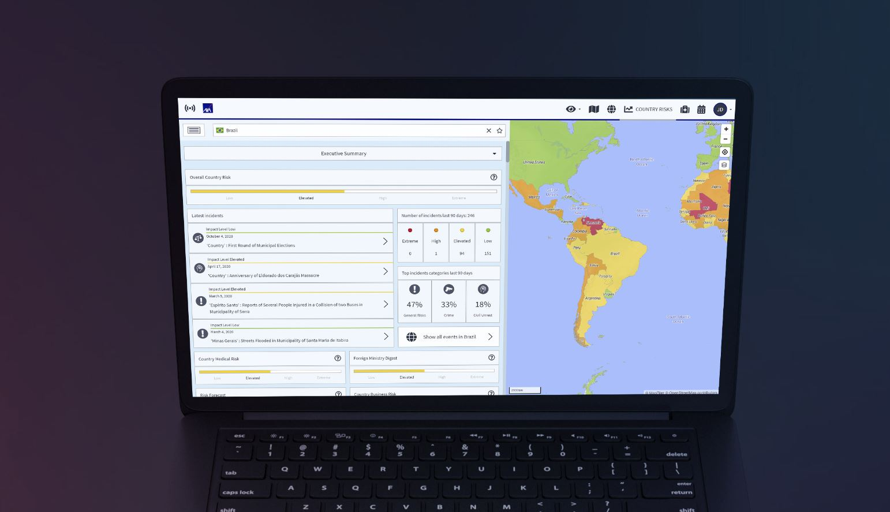

# TRAVEL EYE PLATINUM

## EINFÜHRUNGSVIDEO



## PRODUKT ÜBERSICHT

Travel Eye ist eine **Mobility Risk Management Plattform**, die weltweit 24/7 Sicherheitsvorfälle erkennt und den Ort eines Vorfalls mit dem Aufenthaltsort Ihrer Reisenden abgleicht um automatisch diejenigen Mitarbeiter zu alarmieren, die sich in der Nähe des Vorfalls befinden.

Innerhalb von nur 2 Minuten sagt Ihnen Travel Eye, ob es Ihren Reisenden gut geht oder ob sie Hilfe benötigen. Die Plattform ermöglicht auch Notfallanrufe, Standortmittlungen im Notfall \(wenn zugelassen\) gezielte Statusabfragen.

## SCHLÜSSELFUNKTIONEN

Zusammengefasst, Travel Eye Platinum:

* Erkennt und minimiert Reiserisiken
* Integriert Reisedaten und visualisiert die Position der Reisenden und Standorte
* Erkennt Sicherheitsvorfälle sofort mit der Hilfe von künstlicher Intelligenz
* Gleicht Reisedaten innerhalb von Sekunden mit dem Ort eines Sicherheitsvorfalls ab
* Fragt proaktiv nach dem Status der betroffenen Reisenden und übermittelt diesen an das Management
* Kommuniziert in der Sprache, in der sich Ihre Mitarbeiter wohlfühlen
* Alarmiert automatisch die Verantwortlichen, um Notfallmaßnahmen einzuleiten

## **ZIELSETZUNG DIESES LEITFADENS**

Der folgende Leitfaden beschreibt die wichtigsten Funktionen und Merkmale von Travel Eye Platinum, der Mobility Risk Management Plattform. Hauptsächlich ist der Leitfaden für Administratoren und Manager der Plattform geschrieben, er kann jedoch auch für Nutzer mit weniger umfangreichen Berechtigungen hilfreich sein. Nach jedem Abschnitt finden Sie FAQs, welche Ihnen helfen sollen, Ihre Fragen direkt zu beantworten.


**Bitte beachten Sie:** Dies ist ein Benutzerleitfaden und enthält daher keine detaillierte technische Beschreibung des Notfallprozesses der Plattform oder der Onboarding-/Authentifizierungs- /Anmeldeverfahren.


