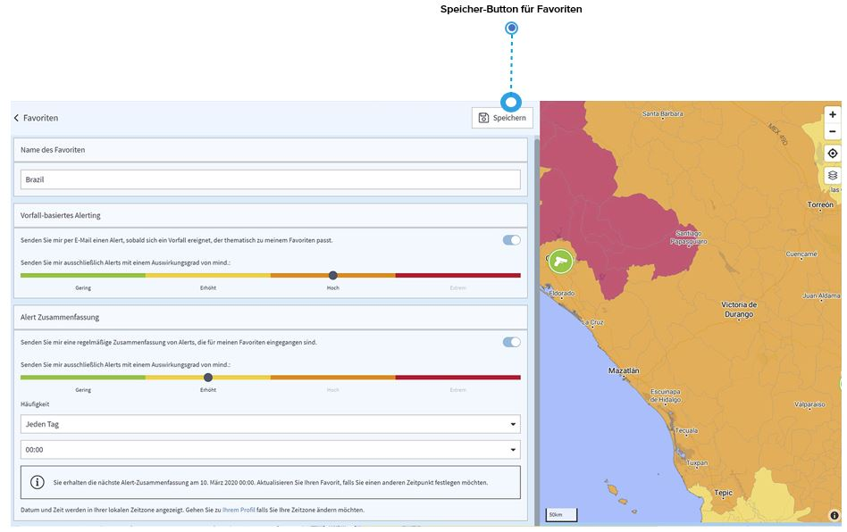

# Länderfavoriten

Wenn Sie sich für Entwicklungen bestimmter Länder interessieren, können Sie diese als Favoriten speichern. Was sind die Vorteile?

* Sie können Ihre Favoriten **direkt** von der Länderinformationsseite aus aufrufen, indem Sie sie aus der Liste der Favoriten auswählen, die Ihnen links auf der Seite angezeigt wird. 
* Noch wichtiger ist, dass Sie **E-Mail-Benachrichtigungen \(Sicherheitsinformationen\)** über sicherheitsrelevante Vorfälle in Ihren Favoritenländern erhalten können. Aktivieren Sie einfach „Senden Sie mir per E-Mail einen Alert“, wählen Sie aus, ab welchem Auswirkungsgrad Sie diese Nachrichten erhalten möchten und „speichern“ sie. Die E-Mail, die Sie erhalten, hat je nach Auswirkungsgrad des Vorfalls, den Betreff „Information oder Alert“. 
* Sie können **regelmäßige Zusammenfassungen** der Informationen für Ihre Favoriten erhalten. Nehmen wir an, Sie möchten montags um 9:00 Uhr eine Übersicht aller Ereignisse der letzten 7 Tage in Ihrem Favoritenland erhalten. Gehen Sie einfach zu "Alert Zusammenfassung", definieren Sie Ihre individuellen Einstellungen und "speichern/aktualisieren" Sie Ihren Favoriten. 
* Außerdem können Sie per **Risk Level Change Alert** eine Benachrichtigung per E-Mail erhalten, wenn sich das Gesamtrisikoniveau eines Landes ändert. 


Die  E-Mails zu Sicherheitsinformationen, die Sie erhalten, sind lediglich Informationen über Ereignisse, die in dem von Ihnen ausgewählten Land stattfinden. Sie sind nicht an den spezifischen Standort eines Reisenden geknüpft. Darüber hinaus haben alle Berechtigungsstufen Zugang zu diesen Einstellungen, auch Reisende.


