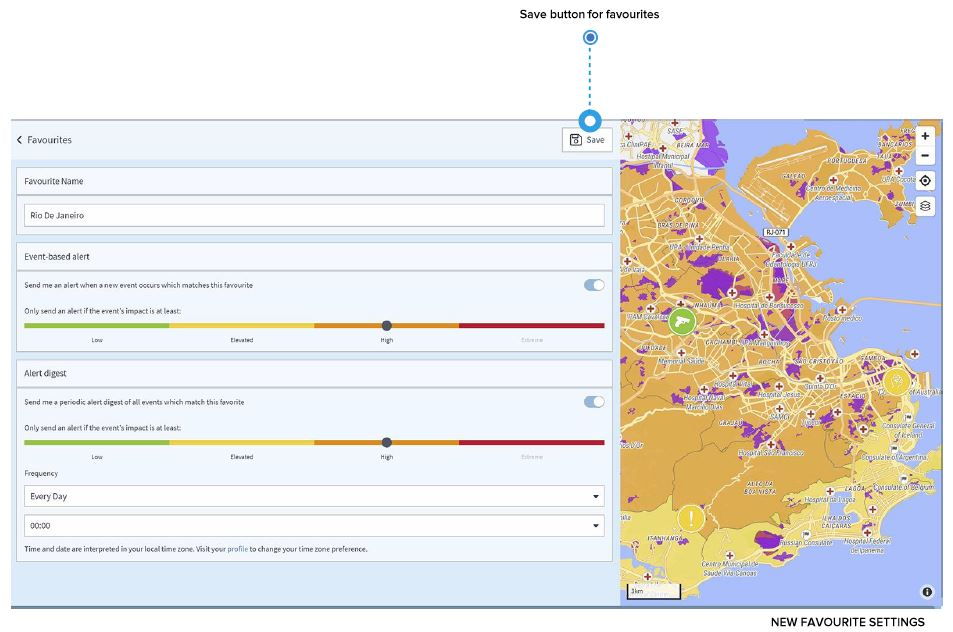

# Country Favourites

If you are interested in specific countries, you can save them as favourites. What are the advantages?

* You can access them **directly from the country risks page** by selecting it from the list of favourites, which is displayed when you click/touch in the search bar on the left of the page. 
* More importantly, ****you can receive country **"security information"** if anything happens in the country. Just select “send me an alert”, then choose from which impact level on you wish to receive alerts and “save”. 
* You can receive a **security information digest** for your favourite countries. Let’s say you want to receive once a week at 9:00am and overview of all events that occurred in the country over the past 7 days. Just go to “Alert digest”, define your individual settings and “save/ update” your favourite. 
* You can also receive **risk level change alerts** in case the overall country risk level changes. 


The security information you receive is an information about events occurring in the country. It is not linked to a specific traveller's location e.g. geocoordinate. Moreover, all permission levels have access to these settings, including travellers.


