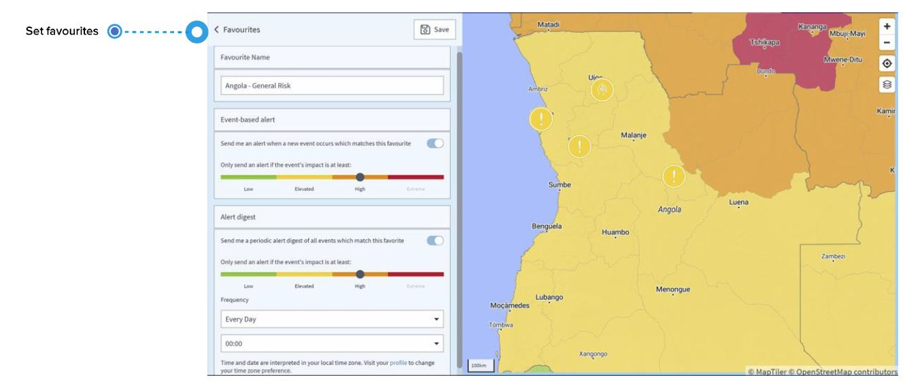

# FAQ

## What is an announcement and a security information, an alert and a special alert?

### **ANNOUNCEMENT**

An announcement is a security-related incident that can be expected in the future, such as strikes and demonstrations.

### SECURITY INFORMATION

A security information/alert is an incident information you receive via email when setting a favourite on the global events page or for a specific country on the country risks page. Once the system detects an incident that matches your favourite, you will receive an email with the incident information. 

Additionally, you can schedule a **periodic alert digest** of all events which match this favourite.

### ALERT

Alerts are linked to the travel monitor settings and not to the Global Events Favourites. An alert is an email about an incident that has possible effects on travellers, sites or business activity. Alerts are related to a specific traveller or a company site location. For each incident that triggers an alert, the system sends different emails – one is tailored to the traveller, the other is tailored to the manager.

### **SPECIAL ALERT**

Special alerts are linked to the travel monitor setting. In the event of a special alert, it cannot be ruled out that a traveller is directly affected by a security incident that can pose a threat to life and health. The platform directly contacts affected travellers via phone call in order to detect their status. In addition, the traveller receives the incident information via email, including behavioural guidelines to reduce the risk in the vicinity of the event. For each incident that triggers a special alert, the system sends different emails – one is tailored to the traveller, the other is tailored to the manager and includes continuous status updates.

