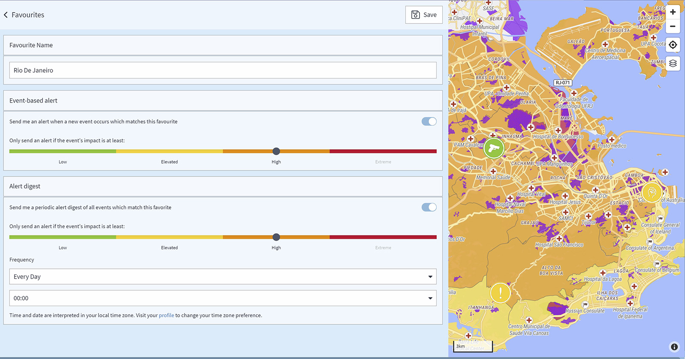

# FAQ

## Was ist eine Ankündigung, eine Sicherheitsinformation, ein Alert und ein Special Alert?

### **ANKÜNDIGUNG**

Eine Ankündigung ist ein vorhersehbarer sicherheitsrelevanter Vorfall in der Zukunft, wie z.B. Streiks und Demonstrationen.

### SICHERHEITSINFORMATION

Sie erhalten Informationen über einen Sicherheitsvorfall per E-Mail, wenn Sie auf der Seite für globale Vorfälle oder für ein bestimmtes Land auf der Seite für Länderinformationen einen Favoriten festlegen. Sobald das System einen Vorfall erkennt, der Ihrem Favoriten entspricht, erhalten Sie eine E-Mail mit der Vorfallsinformation.

Zusätzlich können Sie einen **regelmäßigen Alert Digest** für alle Ereignisse erhalten, die diesem Favoriten entsprechen.

### ALERT

Ein Alert ist eine E-Mail-Information über einen Vorfall, der mögliche Auswirkungen auf Reisende, Standorte oder Geschäftstätigkeiten hat. Alerts sind verbunden mit einem Favoriten in den "Globalen Vorfällen", Alerts beziehen sich auf einen bestimmten Reisenden oder den Standort eines Unternehmens. Für jeden Vorfall, der einen Alert auslöst, sendet das System verschiedene E-Mails – eine ist auf den Reisenden, die andere auf den Travel Manager zugeschnitten.

### **SPECIAL ALERT**

Im Falle eines Special Alerts kann nicht ausgeschlossen werden, dass ein Reisender direkt von einem Sicherheitsvorfall betroffen ist, der eine Bedrohung für Leben und Gesundheit darstellen kann. Travel Eye kontaktiert betroffene Reisende direkt per Telefonanruf, um ihren Status zu ermitteln. Außerdem erhält der Reisende die Informationen über den Vorfall per E-Mail, einschließlich Verhaltensrichtlinien, um das Risiko in der Nähe des Ereignisses zu verringern. Für jeden Vorfall, der einen Special Alert auslöst, sendet das System verschiedene E-Mails – eine ist auf den Reisenden, die andere auf den Manager zugeschnitten und enthält laufende Statusaktualisierungen.

