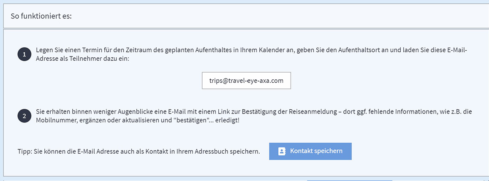

# Integration von Reisedaten

### CHECK-IN BUTTON IN DER NAVIGATIONSLEISTE

Die Check-in Funktion in der Navigationleise dient als kürzeste und genaueste Möglichkeit, die Position eines Reisenden an die Plattform zu übermitteln und die Person anhand der Telefonnummer und E-Mail-Adresse ihres Benutzerprofils ins Monitoring und Alerting zu integrieren. Der Benutzer wird genau an den Geokoordinaten gemonitored, die beim letzten Check-in gesendet wurden. Die jeweiligen Manager können den Reisenden und seine Position im Travel Monitor sehen. Nach sieben Tagen ohne aktualisierte Position wird das Monitoring beendet. Diese Funktion ist ein großer Vorteil wenn die Positionsdaten ungenau sind, z.B. wenn die PNR-Reisedaten nur den Ort des Ankunftsflughafens angeben. Auch wenn keine Zeit war, um eine Reise zu registrieren \(per Kalender oder PNR-Registrierung\), kann der Reisende auf diesem Weg per Check-in nach wenigen Augenblicken von der Plattform gemonitored und wenn nötig direkt alarmiert werden.

### KALENDER REISEANMELDUNG

Eine Reiseanmeldung über den Kalender, ermöglicht es Ihren Reisenden , die Plattform zu jedem ihrer Termine und Reisen weltweit einzuladen. Dies gilt sowohl für die 3-tägige Städtereise mit Geschäftsterminen, wie auch für den Besuch eines Projektstandortes in einer abgelegenen Hochrisikoregion und sogar für kurze Zwischenstopps oder ein Abendessen. Travel Eye wird der Begleiter Ihrer Reisenden sein, welcher sie proaktiv informiert, wenn ein Sicherheitsvorfall eintritt und Notfallmaßnahmen einleitet, wenn die Plattform sie in Gefahr sieht.

Registrieren Sie Ihre Reise einfach durch Ihre persönliche Kalenderanwendung – im Büro mit Ihrem Desktopcomputer oder unterwegs mit Ihrem Smartphone.

1. Erstellen Sie in Ihrem Kalender einen Termin für die Dauer Ihrer Reise, nennen Sie Ihr Reiseziel und laden Sie die firmenspezifische E-Mail-Adresse als Teilnehmer ein. Sie finden die E-Mail-Adresse in der Plattform unter Kalender-Tracking. 
2. Innerhalb weniger Augenblicke erhalten Sie eine E-Mail mit einem Link zur Bestätigung der Registrierung. Dieser Link führt zu einer Webseite, auf der Sie Ihren Standort und Ihre Kontaktdaten, wie z.B. Ihre Mobiltelefonnummer, direkt hinzufügen oder aktualisieren können. Zum Schluss bestätigen Sie die Reise ... und fertig!

**Vorteile des Kalender Trackings:**

* **SCHNELL – In NUR WENIGEN Schritten:** Registrieren Sie Reisen in zwei einfachen Schritten, wo immer Sie sich befinden - im Büro mit Ihrem Computer oder unterwegs mit Ihrem Smartphone. Legen Sie einfach einen Termin für die Dauer Ihrer Reise an, laden Sie die Plattform als Teilnehmer ein und bestätigen Sie die Reiseanmeldung. 
* **EINFACH – Einfach mit IHREM PERSÖNLICHEN KALENDER:** Sie können Ihre Reise einfach über Ihre persönliche Kalenderanwendung registrieren. Die Plattform unterstützt alle gängigen Kalenderanwendungen, einschließlich Outlook, iCal und Gmail.
* **FLEXIBEL – Ihre Flüge ändern sich? Passen Sie einfach Ihren Termin im Kalender an**: Sie können den Termin in Ihrem Kalender jederzeit verschieben, verlängern oder absagen. Ihre Änderungen werden sofort an die Plattform weitergeleitet.


Bitte beachten Sie, dass das Kalender Tracking nur für Reisende nutzbar ist, die im System registriert sind und somit vom System identifiziert werden können.


