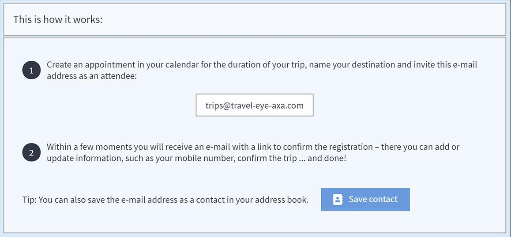

# Travel Data Integration

### CHECK IN BUTTON IN THE NAVIGATION BAR 

The check in feature in the navigation bar serves as the shortest and most accurate way to submit a traveller’s position to the platform and integrate the person, based on the phone number and email address of his user profile, into the platform monitoring and alerting. The user will be monitored at exactly the geo-coordinates sent by the last check in. Managers can see the traveller and his position in the travel monitor. After seven days with no updated position, the monitoring will be terminated. This function is a huge advantage in cases where position data are rather inaccurate, e.g. if PNR travel data only provide the location of the arrival airport. Also, if there has been no time for another travel registration \(calendar or PNR registration\) at all, with the push of a button, the traveller is being taken care of by the platform’s monitoring and alerting after a few moments.

### CALENDAR TRIP REGISTRATION

Many times, your travellers cannot be monitored properly because you don’t know where they are? Why not? Incomplete booking data, spelling mistakes in names, missing or wrong phone numbers and email addresses make tracking and contacting your travellers difficult. So how can we solve this problem? We provide an efficient option to solve this problem – via trip registration through your personal calendar. 

The calendar registration allows your travellers to invite the platform to any of their appointments and trips worldwide. Travellers can invite the platform to their 3-day city trip with business meetings as well as to their visit to a project site located in a rural high-risk area and even to short stops along the road. The platform will be your travellers’ companion that informs them proactively if a security incident occurs and initiates emergency procedures, if it finds them in danger

**How does it work?** \(please note that is text is written to be forwarded to the travellers\)

Simply register your trip through your personal calendar application – at the office with your desktop PC or on the go with your smartphone.

1. **Create an appointment** in your calendar for the duration of your trip, name your destination and invite the company specific email address as an attendee. You will find the email address in the platform under Calendar Trip Registration. 
2. Within a few moments you will receive an email with a link to **confirm the registration**. This link leads to a confirmation page where you can directly add or update your location and contact details, such as your mobile number. Finally confirm the trip ... and done!!


You can also save the email address to your contacts.


Benefits of  the calendar tracking :

* **QUICK — In ONLY A FEW Steps:** Register trips in two easy steps wherever you are – at the office with your desktop PC or on the go with your smartphone. Just create an appointment for the duration of your trip, invite the platform as an attendee and confirm the trip registration. 
* **EASY — Simply using YOUR PERSONAL CALENDAR:** You can register your trip easily through your personal calendar application. The platform supports any common calendar applications, including Outlook, iCal and Gmail.
* **FLEXIBLE — Your flights change? Just adapt your calender event**: You can postpone, extend or cancel the appointment in your calendar at any time. Your changes are forwarded to the platform immediately.


Please note that only travellers that have a platform account and can thus be identified, are entitled to use calendar tracking.


