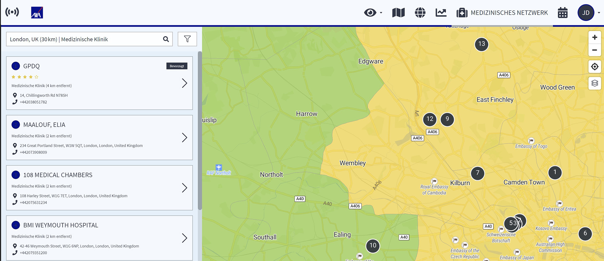

# Medizinisches Netzwerk

#### Finden Sie den besten medizinischen Dienstleiser

Die Seite des medizinischen Netzwerks enthält eine lange Liste von medizinischen Anbietern, die Sie über die Filteroption auswählen können. Beginnen Sie mit der Auswahl des Ortes, an dem Sie einen medizinischen Dienstleister oder ein Krankenhaus suchen, und geben Sie eine medizinische Kategorie oder ein medizinisches Fachgebiet ein. Um Ergebnisse zu erhalten, wählen Sie jeweils Anwenden.

Die Ergebnisse zeigen Ihnen eine Liste von Krankenhäusern, die ebenfalls in der Karte visualisiert wird. Sie können auf die Symbole in der Karte klicken, um weitere Informationen zu erhalten.

Um die Sprache oder die Öffnungszeiten genauer zu wählen, verwenden Sie die Filteroption.

Um die Ergebnisse zu sehen, wählen Sie Anwenden und zurück.

