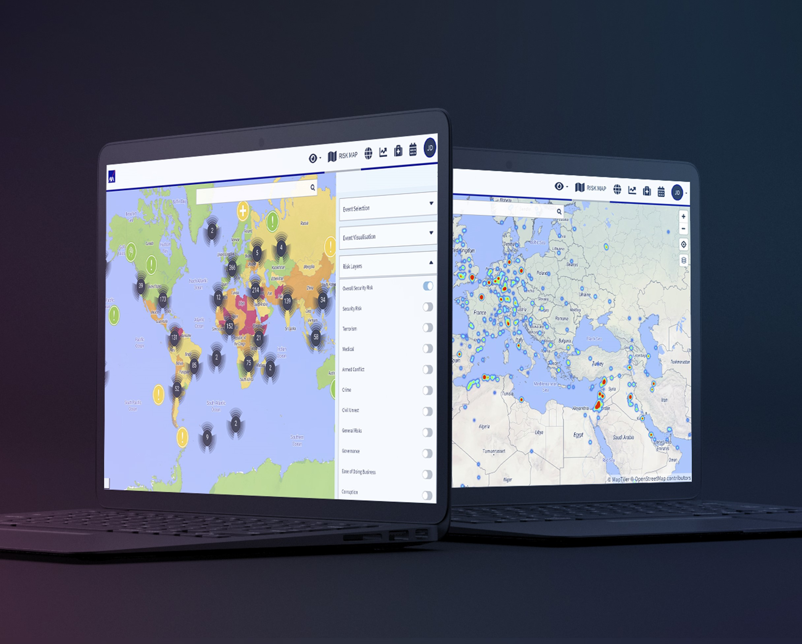
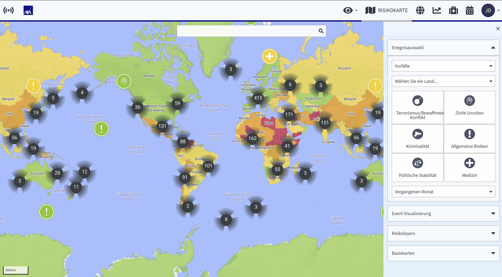
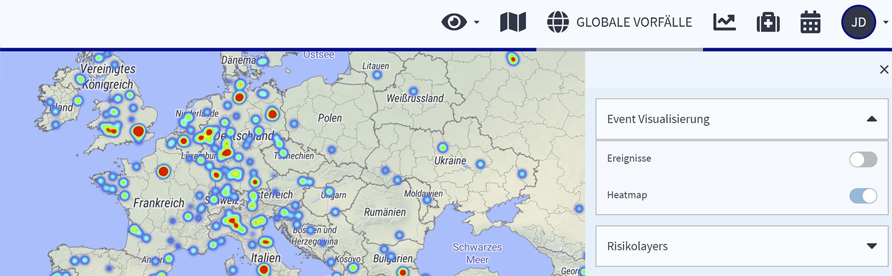

# Risikokarte

## Was ist die Risikokarte?

Die Risikokarte ist das Herzstück der dynamischen Länderinformationen.

Wenn man in die Risikokarte hineinzoomt, werden AXA-Risikoeinstufungen der Länder sowie auch Risiken innerhalb der Länder sichtbar. Die Karte zeigt das Risiko von Verwaltungseinheiten und Provinzen, **bis hinunter zu Städten und sogar Stadtbezirken**. Ein näherer Blick auf wichtige Städte z.B. Rio de Janeiro zeigt violett markierte **Gebiete mit einem höheren Risiko für Reisende** auf. Sie können sich verschiedene Informationen, Kartentypen und Ebenen anzeigen lassen.

Mit Hilfe der Ereignisauswahl und Ereignisvisualisierung können Sie ein erstes Risikoprofil einer Region erstellen, das auf den Sicherheitsvorfällen in den für Sie interessanten Risikokategorien und in einem bestimmten Zeitraum basiert.


Es wird empfohlen, mit Hilfe der **Suchzeile** in der Karte zu navigieren, vor allem wenn Sie genau wissen, welchen Ort Sie suchen.


### HEATMAP

Die **Heatmap** zeigt Ihnen auf einen Blick die Hot Spots innerhalb des Landes. Durch Ihre Filter definiert, zeigt sie Ihnen, welche Bereiche zu meiden sind und welche Bereiche höhere Sicherheitsmaßnahmen erfordern. Eine Bedrohung, die vor drei Jahren akut war, muss nicht unbedingt heute noch vorliegen, weshalb die Verwendung des Zeitfilters zwingend notwendig ist, **um eine klare Antwort auf Ihre Fragen zu erhalten.**

