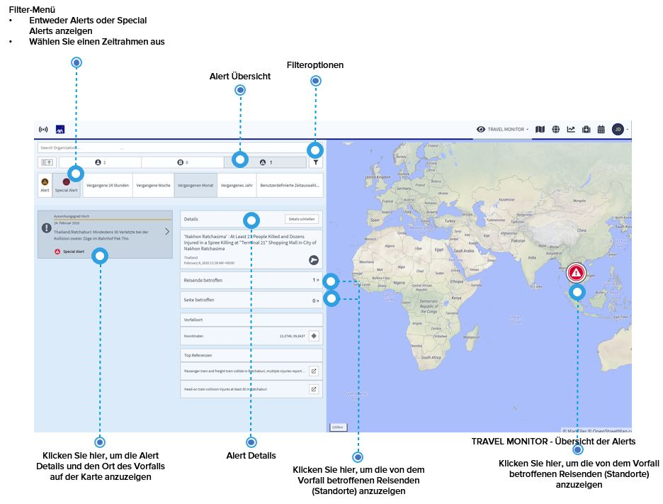
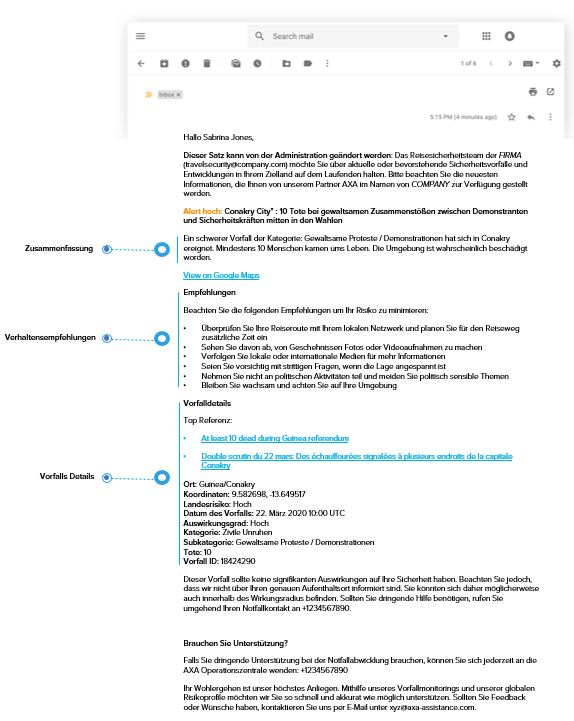
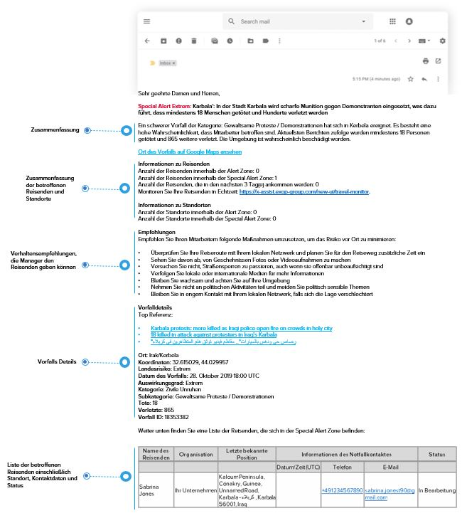

# Alerts und Special Alerts

Die Auswahl der Alert-Übersicht führt Sie direkt zu den Alerts/Special Alerts, die Ihre Reisenden erhalten haben. Um die Liste der angezeigten Vorfälle zu verkürzen, können Sie entweder Alerts oder Special Alerts anzeigen, einen bestimmten Zeitraum definieren oder ein bestimmtes Land über die Suchleiste auswählen.

Auch hier werden die Informationen, die Sie in der Liste erhalten, auf der Karte dargestellt. Wenn Sie einen Vorfall auswählen, erhalten Sie wichtige Informationen über den Vorfall, wie z.B.:

* Land des Vorfalls & der Schlagzeile
* Vorfallskategorie/Unterkategorie
* Auswirkung des Vorfalls 
* Referenzen 
* Vorfalls ID 
* Und die betroffenen Reisenden: Klicken Sie auf den Button, um eine Liste der Reisenden anzuzeigen, die von dem Vorfall betroffen waren, mit der Option, auch die Details der Reisenden anzeigen zu lassen. 


**Bitte beachten Sie**: Ausführlichere Informationen zu diesem Thema finden Sie im Abschnitt Alerting Einstellungen.


## E-Mail Beispiele für Alerts and Special Alerts

### Alert für Reisende

### Alert für Manager

### Special Alert für Reisende

### Special Alert für Manager

