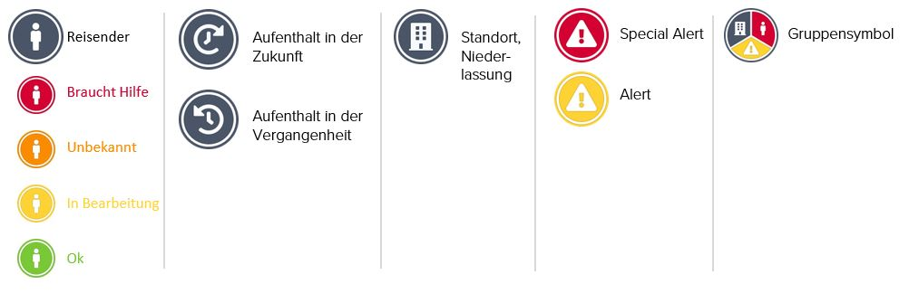

# Status und Icons

Auf der Karte des Travel Monitors finden Sie die untenstehenden Symbole.


**Bitte beachten Sie**, dass mehrere Reisende, Standorte und Alerts am selben Ort \(je nach Zoomstufe\) in einem Symbol gruppiert sind. Klicken Sie auf das Gruppensymbol, um die verschiedenen Informationen zu jedem einzelnen Objekt zu erhalten.


Die Symbole für Reisende haben unterschiedliche Farben, je nach ihrem **Status innerhalb der letzten 72 Stunden**:

| Farbe | Status | Beschreibung |
| :--- | :--- | :--- |

<table>
  <thead>
    <tr>
      <th style="text-align:left">Gr&#xFC;n</th>
      <th style="text-align:left"><b>Ok  </b>
      </th>
      <th style="text-align:left">
        <ul>
          <li>Statusr&#xFC;ckmeldung von Reisenden im Rahmen des automatischen Statusanrufs,
            dass es ihnen gut geht</li>
          <li>Statusr&#xFC;ckmeldungen von Reisenden per E-Mail oder Telefon, dass es
            ihnen gut geht</li>
          <li>Statusr&#xFC;ckmeldung, dass es dem Reisenden gut geht, &#xFC;ber einen
            der Notfallkontakte per E-Mail oder Telefon</li>
        </ul>
      </th>
    </tr>
  </thead>
  <tbody></tbody>
</table><table>
  <thead>
    <tr>
      <th style="text-align:left">Gelb</th>
      <th style="text-align:left"><b>In Bearbeitung</b>
      </th>
      <th style="text-align:left">
        <ul>
          <li>Die Serie der automatischen Statusanrufe ist noch nicht abgeschlossen.
            Es wurde noch keine Statusr&#xFC;ckmeldung gegeben.</li>
        </ul>
      </th>
    </tr>
  </thead>
  <tbody></tbody>
</table><table>
  <thead>
    <tr>
      <th style="text-align:left">Orange</th>
      <th style="text-align:left"><b>Unbekannt</b>
      </th>
      <th style="text-align:left">
        <ul>
          <li>Es wurden alle Statusanrufe durchgef&#xFC;hrt und kein Status &#xFC;bermittelt
            (Telefon ausgestellt, Anrufbeantworter, keine Verbindung).</li>
          <li>Statusr&#xFC;ckmeldung erfolgt durch Dritte, also nicht durch den Reisenden
            selbst oder einen der Notfallkontakte. Der Assistance-Dienstleister informiert
            die Notfallkontakte entsprechend, inklusive Namen und Kontaktdaten.</li>
        </ul>
      </th>
    </tr>
  </thead>
  <tbody></tbody>
</table><table>
  <thead>
    <tr>
      <th style="text-align:left">Rot</th>
      <th style="text-align:left"><b>Braucht Hilfe</b>
      </th>
      <th style="text-align:left">
        <ul>
          <li>Statusr&#xFC;ckmeldung von Reisenden, dass sie Hilfe brauchen als direkte
            Antwort auf den automatischen Statusanruf.</li>
          <li>Der Assistance-Dienstleister hat klare Anzeichen, dass sich die betroffenen
            Reisenden in einer kritischen Situation (Gefahr f&#xFC;r Leib, Leben oder
            Gesundheit) befinden und wird den Notfallprozess einleiten.</li>
        </ul>
      </th>
    </tr>
  </thead>
  <tbody></tbody>
</table><table>
  <thead>
    <tr>
      <th style="text-align:left">Wei&#xDF;</th>
      <th style="text-align:left"><b>Kein Status</b>
      </th>
      <th style="text-align:left">
        <ul>
          <li>Reisende, die in den vergangenen 72 Stunden keinen automatischen Statusanruf
            von der Plattform erhalten haben, haben keinen Status.</li>
        </ul>
      </th>
    </tr>
  </thead>
  <tbody></tbody>
</table>
**Bitte beachten Sie**, dass sowohl der Status _Unbekannt_ als auch der Status _Hilfe_ darauf hindeuten, dass Reisende in Gefahr sind und Hilfe benötigen könnten. Der Assistance-Dienstleister wird den Notfallprozess einleiten, den Notfallkontakt informieren und entsprechende Folgemaßnahmen koordinieren.


### Wie funktioniert ein automatisierter Statusanruf und wie kann ich sehen, ob Reisende von einem Vorfall betroffen sind?

The platform automatically detects and communicates the status of registered travellers. It works as follows:

1. Plattform findet einen kritischen Sicherheitsvorfall, der höchstwahrscheinlich eine Bedrohung für Ihre Reisenden in der unmittelbaren Umgebung darstellt.
2. Der Sicherheitsvorfall löst je nach Ihren individuellen Einstellungen im Travel Monitor eine Reihe von automatischen Statusanrufen und eine Special Alert E-Mail aus.
3. Es gibt drei mögliche Statusrückmeldungen, welche die Plattform erkennen kann: **OK**, **HILFE** und **KEINE REAKTION**. Der aktuelle Status der Reisenden wird im Travel Monitor ständig aktualisiert \(grün **OK**, gelb in BEARBEITUNG, orange **UNBEKANNT**, rot **HILFE**\). Während die Statusabfragen laufen, werden den Report Empfängern die Status ebenfalls fortlaufend per E-Mail übermittelt. Wenn Handlungsbedarf besteht \(Status Unbekannt oder Hilfe\), werden die Report Empfänger zusätzlich explizit per E-Mail informiert.

### Kann ich den Status einer bestimmten Gruppe von Reisenden überprüfen?

Sie können die automatische Statusermittlung auch manuell auslösen, ohne dass eine Verbindung zu einem Special Alert besteht. In diesem Fall wählen Sie in der Liste der Reisenden diejenigen aus, von denen Sie einen aktuellen Status benötigen, und klicken auf die Funktion „Status anfordern". Die Plattform wird die ausgewählten Reisenden anrufen und ihren Status abfragen. Sie können die ständig aktualisierten Status im Travel Monitor verfolgen \(grün Ok, gelb in Bearbeitung, orange Unbekannt, rot Hilfe\). Besteht Handlungsbedarf \(Status Unbekannt oder Hilfe\), werden die Report Empfänger ebenfalls explizit per E-Mail informiert.

