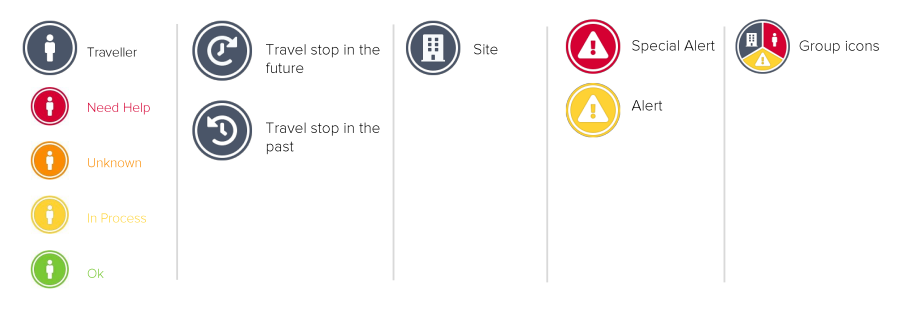

# Status and Icons

On the travel monitor map we use the following icons.


Several travellers, sites and alerts in the same location \(depending on the zoom level\) are grouped in one icon. Click on the group icon to separate the information on each grouped object.


The traveller icons have different colours, depending on their **status within the past 72 hours**:

| Colour | Status | Description |
| :--- | :--- | :--- |

<table>
  <thead>
    <tr>
      <th style="text-align:left">Green</th>
      <th style="text-align:left"><b>Ok</b>
      </th>
      <th style="text-align:left">
        <ul>
          <li>Status feedback by travellers as response to the automatic status call
            that they are well</li>
          <li>Status feedback by travellers via email or telephone that they are well</li>
          <li>Status feedback that the traveller is well, through one of the emergency
            contacts by email or phone</li>
        </ul>
      </th>
    </tr>
  </thead>
  <tbody></tbody>
</table><table>
  <thead>
    <tr>
      <th style="text-align:left">Yellow</th>
      <th style="text-align:left"><b>In Process</b>
      </th>
      <th style="text-align:left">
        <ul>
          <li>The automatic status call series is still ongoing. No status feedback
            has yet been issued.</li>
        </ul>
      </th>
    </tr>
  </thead>
  <tbody></tbody>
</table><table>
  <thead>
    <tr>
      <th style="text-align:left">Orange</th>
      <th style="text-align:left"><b>Unknown</b>
      </th>
      <th style="text-align:left">
        <ul>
          <li>No status was detected until the last status call has been completed (telephone
            switched off, voice mail, call not answered, no connection).</li>
          <li>Status feedback by a third party, other than travellers or emergency contacts.
            The emergency assistance provider informs emergency contacts, including
            name and contact of the third party.</li>
        </ul>
      </th>
    </tr>
  </thead>
  <tbody></tbody>
</table><table>
  <thead>
    <tr>
      <th style="text-align:left">Red</th>
      <th style="text-align:left"><b>Need Help</b>
      </th>
      <th style="text-align:left">
        <ul>
          <li>Status feedback by travellers that they need help as direct response to
            the automatic status call.</li>
          <li>The emergency assistance provider has clear indication that affected travellers
            are in critical danger (threat to life, limb or health) and will initiate
            the emergency assistance process.</li>
        </ul>
      </th>
    </tr>
  </thead>
  <tbody></tbody>
</table><table>
  <thead>
    <tr>
      <th style="text-align:left">White</th>
      <th style="text-align:left"><b>No Status</b>
      </th>
      <th style="text-align:left">
        <ul>
          <li>Travellers who have not received an automated status call from the platform
            in the past 72h have no status.</li>
        </ul>
      </th>
    </tr>
  </thead>
  <tbody></tbody>
</table>
Please note that both statuses _Unknown_ and _Need Help_ indicate that travellers might be in danger and need assistance. The emergency assistance provider will initiate an assistance case, inform the emergency contact and coordinate specific follow-up measures.


### **How does the platform work and how can I see if travellers are affected by an incident?**

The platform automatically detects and communicates the status of registered travellers. It works as follows:

1. The platform finds a critical security incident, most likely posing a threat to your travellers in the vicinity..
2. The critical incident triggers a series of automated status calls and a special alert email, according to your individual settings in the travel monitor.
3. There are three possible status call feedbacks the platform can detect: **OK**, **HELP** or **NO RESPONSE**. The current status of the travellers is continuously updated in the travel monitor \(green **OK**, yellow in **PROCESS**, orange **UNKNOWN**, red **HELP**\). The statuses are also continuously communicated to the report recipients by email. If there is a need for action \(status Unknown or Help\), report recipients are in addition, explicitly informed by email.

### Can I check the status of a specific group of travellers?

You can also trigger the automated status detection manually, with no connection to a special alert incident. In this case, you select those travellers you need an updated status from in the traveller list and click the button „request status“. The platform will call the selected travellers and determine their status. You can follow the continuously updated statuses in the travel monitor \(green Ok, yellow in Process, orange Unknown, red Help\). If there is a need for action \(status Unknown or Help\), report recipients are also explicitly informed by email.

