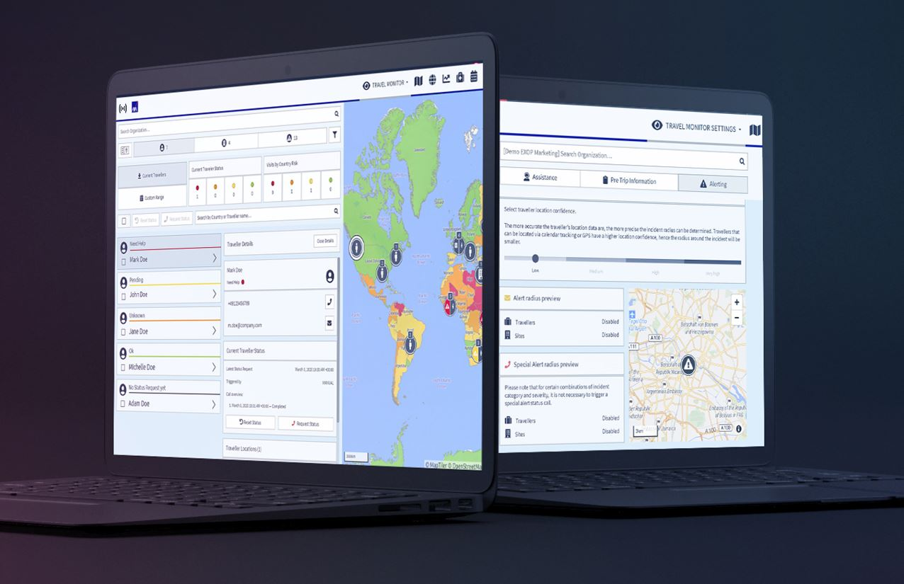

# Travel Monitor Settings

The **Travel Monitor** is the heart of the platform. Travel managers can monitor and overview travellers and their statuses worldwide, trace emergencies and initiate status calls. According to your settings, the Travel Monitor steers and defines alerting, communication and emergency procedures for your company.

## What does the Travel Monitor look like?

Setting up the platform takes around 10 minutes, once you have defined all your settings, you will have the system do the job for you.

Take your time to define your company settings in the sections:

* Assistance
* Pre-trip information
* Alerting


Please note that we have prepared a set of default settings to make your start easier.


