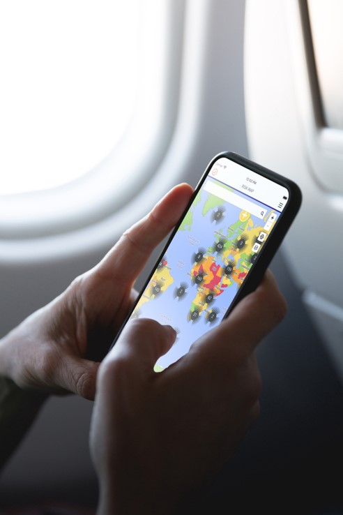
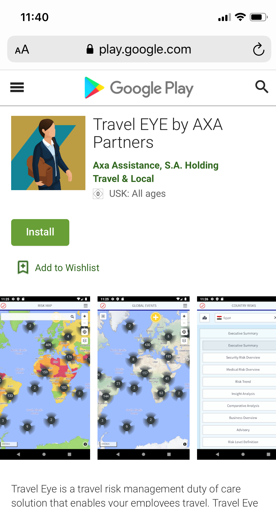
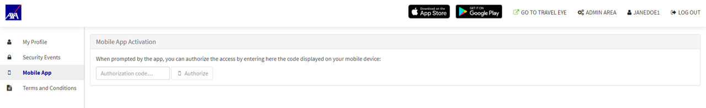

# Travel Eye App

Travel Eye is also available as **browser-based web application** and as **native mobile app**, providing you with all the powerful features of the desktop version:

* **Emergency Call** – if you are in danger, you can reach AXA Operations Centre 24/7
* **Status Calls** – if a security incident occurs nearby, you will receive calls to check if you need help
* **Alerting** - you will receive e-mails informing you about the latest security developments and incidents onground
* **Pre-Trip Information** – you will receive the latest security and medical information before departure
* **Travel Security Information** – you can access all relevant information of your travel destination at any time

## Browser-based Web App

The browser-based web app is the preferred option for companies that generally do not allow downloads from the Play or Apple Store. Without downloading the app from the stores, users will have access to all functionalities via the browser, including sharing of geo-location and the emergency button.

## Native App

The Travel Eye App for IOS and Android is available \(Play Store or App Store\) with the all the functionalities of the TRAVEL EYE desktop application.

## App Activation

To activate the app, please do as follows:

1. Log into the platform as you usually do and open your user profile. Click „_Mobile App_“ on the left side of the screen. 
2. Install and tart the app on your mobile device. The app welcome screen shows an 8-letter authorisation code. 
3. Enter the code in the field „_Authorisation code_…“ in your user profile click „_Authorise_“. 
4. You are now permanently logged into the app on your mobile device.

